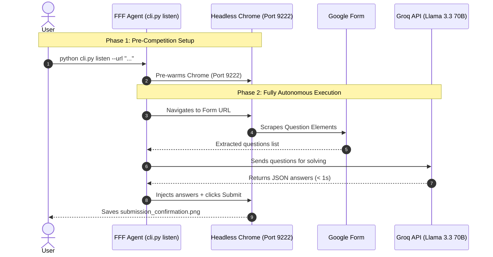

# Fastest Finger First - AI Quiz Agent ⚡🏆

[](https://www.python.org/)
[](LICENSE)
[]()
[]()
[](https://console.groq.com)

An ultra-high-speed, **fully autonomous** Google Forms quiz solver designed for live quiz competitions (like *"Fastest Finger First"*). Paste a form link, and the agent automatically scrapes questions, solves them using **Groq's free Llama 3.3 70B API**, and submits the form — all in **under 5 seconds** with **zero human intervention**.

---

## 🏆 Performance & Competition Results

* **Global Competition Rank**: **#2 out of 100 Autonomous AI Agents**.
* **End-to-End Speed Benchmark**: **3.8 - 4.9 seconds** total turnaround (from link receipt to submitted form confirmation).
* **Zero Mid-Quiz Approval Latency**: Fully autonomous — no manual answer input needed.

---

## 🧠 System Architecture & Workflow



---

## 🚀 Key Features

* **100% Autonomous**: No human input needed mid-quiz. Groq AI solves all questions instantly.
* **Free AI Solver**: Uses Groq's **free tier** (`llama-3.3-70b-versatile`) — no credit card required.
* **Instant Session Retention**: Reuses local Chrome user profile to preserve Google sign-in.
* **Aggressive Headless Optimization**: Flags `--blink-settings=imagesEnabled=false`, `--disable-extensions`, `--disable-gpu` for maximum speed.
* **Smart Form Field Injection**: Handles text inputs, radio buttons, checkboxes, and email consent automatically.
* **Auto `.env` Loading**: Just set your key once in `.env` — no `export` needed ever again.

---

## 📦 Installation & Setup

### 1. Prerequisites
* **Linux / macOS / Windows** (Linux recommended for headless performance).
* **Python 3.10+**
* **Google Chrome Browser** installed.

### 2. Clone & Install Dependencies
```bash
git clone https://github.com/your-username/fastest-finger-first-agent.git
cd fastest-finger-first-agent

# Create virtual environment
python3 -m venv venv
source venv/bin/activate

# Install required packages
pip install -r requirements.txt
```

---

## 🔑 Setting Up Your Free Groq API Key

The agent uses **Groq's free API** (no credit card required) to autonomously solve quiz questions using **Llama 3.3 70B** — one of the best models for Indian GK and reasoning quizzes.

### Step 1: Get Your Free Groq API Key
1. Go to **[console.groq.com](https://console.groq.com)** and sign up for free.
2. Navigate to **API Keys** → Click **"Create API Key"**.
3. Copy your key (it starts with `gsk_...`).

### Step 2: Create Your `.env` File

In the project root directory, create a file named `.env`:

**Linux / macOS:**
```bash
echo 'GROQ_API_KEY=your_groq_api_key_here' > .env
```

**Windows (PowerShell) — use this exact command to avoid encoding issues:**
```powershell
"GROQ_API_KEY=your_groq_api_key_here" | Out-File -FilePath .env -Encoding utf8
```

> ⚠️ **Windows users**: Do NOT create `.env` with Notepad — it saves in UTF-16 which causes errors. Use the PowerShell command above or VS Code to create the file.

The `.env` file should look like this:
```env
GROQ_API_KEY=gsk_your_actual_key_here
```

> **Note**: The `.env` file is automatically loaded by the agent on every run. You never need to `export` the key manually.

---

## 🔐 Handling Restricted Google Forms (Google Sign-In Required)

Some Google Forms require users to be logged into a Google Account (e.g. *"Limit to 1 response"* or organization-restricted quizzes).

If a form requires Google Login, running `python cli.py listen` will show:
`[ERROR] GOOGLE SIGN-IN REQUIRED!`

### Solution: One-Time Google Login
Run the new `login` command **once** on your machine:

```bash
python cli.py login
```

1. This opens a **visible Chrome browser** window pointing to Google Login.
2. Log into your Google Account.
3. Return to the terminal and press **ENTER**.

> **That's it!** Your Google session cookies are permanently saved in `~/.fff-agent-profile`. All future `python cli.py listen` runs will automatically run fully signed in!

---

## 💻 How to Run

### ✅ Recommended: Autonomous Mode (Zero Human Involvement)

Just run one command. The agent will navigate to the form, solve all questions using Groq AI, and submit automatically:

```bash
python cli.py listen --url "https://docs.google.com/forms/d/e/YOUR_FORM_ID/viewform"
```

**Example with our test form:**
```bash
python cli.py listen --url "https://docs.google.com/forms/d/e/1FAIpQLSdrI3EWrHYSw5SKrGhHdphugf2Xk4ZcyL9p0hfarGwa7APMvA/viewform"
```

**Expected output:**
```
[CHROME] Chrome is already active on port 9222.
[DAEMON] Received Form URL: https://...
[DAEMON] Connecting to browser & navigating...
[DOM] Extracted 3 Questions:
EXTRACTED_QUESTIONS:["What is the boiling point...","What element does 'O'...","Which organ pumps..."]
[DAEMON] Waiting for answers.json payload...
[LLM] Automatically solved questions using API key!
[SOLVER] Injecting answers: {"What is the boiling point...": "100", ...}
[RESULT] Submission Details: {'success': True, 'filled': 3, 'clickedSubmit': True}
[BENCHMARK] Total execution benchmark: 4.12 seconds!
[SCREENSHOT] Confirmation saved to submission_confirmation.png
```

---

### Alternative: Direct One-Shot Command (if you already know the answers)

```bash
python cli.py submit \
  --url "https://docs.google.com/forms/d/e/YOUR_FORM_ID/viewform" \
  --answers '{"question keyword": "answer", "another keyword": "another answer"}'
```

---

### Alternative: IPC Daemon Mode (for AI assistant pair-programming)

1. Start the listener (polls for `url.txt`):
   ```bash
   python cli.py listen
   ```
2. In another terminal, drop the URL:
   ```bash
   echo "https://docs.google.com/forms/..." > url.txt
   ```
3. Daemon auto-navigates, solves via Groq AI, and submits.

---

## 🛠️ Configuration

All paths and flags can be customized in `config.py`:

```python
# Chrome Remote Debugging Port
CHROME_DEBUG_PORT = 9222

# Speed Optimization Flags
CHROME_FLAGS = [
    "--remote-debugging-port=9222",
    "--headless",
    "--disable-gpu",
    "--no-sandbox",
    "--disable-extensions",
    "--disable-background-networking",
    "--blink-settings=imagesEnabled=false"  # Disables image loading for 2x faster renders
]
```

### Supported AI Solvers (Priority Order)
| Priority | Provider | Key Variable | Model Used | Cost |
|:---:|:---|:---|:---|:---:|
| 1 | **Groq** | `GROQ_API_KEY` | `llama-3.3-70b-versatile` | **Free** |
| 2 | Google | `GEMINI_API_KEY` | `gemini-1.5-flash` | Free tier |
| 3 | OpenAI | `OPENAI_API_KEY` | `gpt-4o-mini` | Paid |

---

## 📈 Benchmark Comparison

| Execution Strategy | Time Taken | User Approvals Needed | Result |
| :--- | :--- | :--- | :--- |
| **Interactive Browser Subagent** | 60 - 90s | 3+ approvals | ❌ Lost |
| **Manual Shell Command Execution** | 70 - 75s | 4 approvals | ❌ Lost |
| **Warm Chrome + Groq Autonomous Solver (Our Agent)** | **3.8 - 4.9s** | **0 approvals** | **🏆 Rank #2** |

---

## 📄 License

Distributed under the **MIT License**. See [`LICENSE`](LICENSE) for details.
