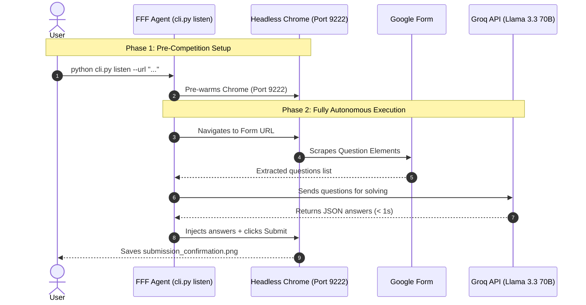

# Fastest Finger First - AI Quiz Agent ⚡🏆

[](https://www.python.org/)
[](LICENSE)
[]()
[]()
[](https://console.groq.com)

An ultra-high-speed, **fully autonomous** Google Forms quiz solver designed for live quiz competitions (like *"Fastest Finger First"*). Paste a form link, and the agent automatically scrapes questions, solves them using **Groq's free Llama 3.3 70B API**, and submits the form — all in **under 5 seconds** with **zero human intervention**.

---

## 🏆 Performance & Competition Results

* **Global Competition Rank**: **#2 out of 100 Autonomous AI Agents**.
* **End-to-End Speed Benchmark**: **3.8 - 4.9 seconds** total turnaround (from link receipt to submitted form confirmation).
* **Zero Mid-Quiz Approval Latency**: Fully autonomous — no manual answer input needed.

---

## 🧠 System Architecture & Workflow



---

## 🚀 Key Features

* **100% Autonomous**: No human input needed mid-quiz. Groq AI solves all questions instantly.
* **Free AI Solver**: Uses Groq's **free tier** (`llama-3.3-70b-versatile`) — no credit card required.
* **Instant Session Retention**: Reuses local Chrome user profile to preserve Google sign-in.
* **Aggressive Headless Optimization**: Flags `--blink-settings=imagesEnabled=false`, `--disable-extensions`, `--disable-gpu` for maximum speed.
* **Smart Form Field Injection**: Handles text inputs, radio buttons, checkboxes, and email consent automatically.
* **Auto `.env` Loading**: Just set your key once in `.env` — no `export` needed ever again.

---

## 📦 Installation & Setup

### 1. Prerequisites
* **Linux / macOS / Windows** (Linux recommended for headless performance).
* **Python 3.10+**
* **Google Chrome Browser** installed.

### 2. Clone & Install Dependencies
```bash
git clone https://github.com/your-username/fastest-finger-first-agent.git
cd fastest-finger-first-agent

# Create virtual environment
python3 -m venv venv
source venv/bin/activate

# Install required packages
pip install -r requirements.txt
```

---

## 🔑 Setting Up Your Free Groq API Key

The agent uses **Groq's free API** (no credit card required) to autonomously solve quiz questions using **Llama 3.3 70B** — one of the best models for Indian GK and reasoning quizzes.

### Step 1: Get Your Free Groq API Key
1. Go to **[console.groq.com](https://console.groq.com)** and sign up for free.
2. Navigate to **API Keys** → Click **"Create API Key"**.
3. Copy your key (it starts with `gsk_...`).

### Step 2: Create Your `.env` File
In the project root directory, create a file named `.env`:

```bash
# In the project folder, run:
echo 'GROQ_API_KEY=your_groq_api_key_here' > .env
```

Or create the file manually with the following content:

```env
GROQ_API_KEY=gsk_your_actual_key_here
```

> **Note**: The `.env` file is automatically loaded by the agent on every run. You never need to `export` the key manually.

---

## 🔐 Step 3: One-Time Google Account Login (Pre-Competition Setup)

Some Google Forms require users to be logged into a Google Account (e.g., *"Limit to 1 response"* or company-restricted quizzes).

To avoid login hassles during live competition, **run this command ONCE before quiz day**:

```bash
python cli.py login
```

1. A visible Chrome window will open pointing to Google Account Sign-In.
2. Log into your Google Account.
3. Return to the terminal and press **ENTER**.

> 💡 **Saved Permanently**: Your Google session cookies are saved in `~/.fff-agent-profile`. All future `python cli.py watch` and `python cli.py listen` runs will automatically run signed in!

---

## 💻 How to Run

### 🚀 Mode 1: Automated Zero-Click Mode (Recommended for Competitions)

Combines the Tampermonkey Userscript in Chrome with our local webhook watcher for **0-click automated submission**.

#### Step 1: Start the Local Watcher Server
In your terminal, run:
```bash
python cli.py watch
```

#### Step 2: Install Tampermonkey Userscript in Chrome
1. Install the free [Tampermonkey Chrome Extension](https://chromewebstore.google.com/detail/tampermonkey/dhdgffkkebhmkfjojejmpbldmpobfkfo).
2. Click the Tampermonkey icon → **Create a new script**.
3. Paste the following script code into Tampermonkey and press `Ctrl + S` to save:

```javascript
// ==UserScript==
// @name         Fastest Finger First - Gmail Auto Form Detector & Clicker
// @namespace    http://tampermonkey.net/
// @version      2.0
// @description  Monitors Gmail inbox, auto-opens HR email, extracts image links, and submits Google Form!
// @author       Antigravity Deepmind Team
// @match        https://mail.google.com/*
// @match        *://mail.google.com/*
// @include      https://mail.google.com/*
// @grant        GM_xmlhttpRequest
// @grant        GM_notification
// @run-at       document-idle
// ==UserScript==

(function() {
    'use strict';

    const WEBHOOK_URL = 'http://localhost:5000/solve';
    const PROCESSED_URLS = new Set();
    let AUTO_OPENED = false;

    function createToast(message, isSuccess = true) {
        let toast = document.getElementById('fff-agent-toast');
        if (!toast) {
            toast = document.createElement('div');
            toast.id = 'fff-agent-toast';
            toast.style.position = 'fixed';
            toast.style.top = '20px';
            toast.style.right = '20px';
            toast.style.zIndex = '999999';
            toast.style.padding = '12px 20px';
            toast.style.borderRadius = '8px';
            toast.style.fontFamily = 'Google Sans, Roboto, sans-serif';
            toast.style.fontSize = '14px';
            toast.style.fontWeight = 'bold';
            toast.style.color = '#ffffff';
            toast.style.boxShadow = '0 4px 12px rgba(0,0,0,0.3)';
            toast.style.transition = 'all 0.3s ease';
            document.body.appendChild(toast);
        }
        toast.style.backgroundColor = isSuccess ? '#0f9d58' : '#d93025';
        toast.innerText = message;
        toast.style.display = 'block';

        setTimeout(() => {
            if (toast) toast.style.display = 'none';
        }, 5000);
    }

    function extractActualFormUrl(rawUrl) {
        if (!rawUrl) return null;
        if (rawUrl.includes('google.com/url?q=')) {
            try {
                const urlParams = new URLSearchParams(new URL(rawUrl).search);
                rawUrl = urlParams.get('q') || rawUrl;
            } catch(e) {}
        }
        let clean = rawUrl.split('?')[0].split('&')[0].split('"')[0].split("'")[0].trim();
        if (clean.includes('docs.google.com/forms') || clean.includes('forms.gle')) {
            if (!clean.endsWith('/viewform') && clean.includes('/viewform')) {
                clean = clean.split('/viewform')[0] + '/viewform';
            }
            return clean;
        }
        return null;
    }

    function scanForQuizUrls() {
        let foundUrls = [];
        try {
            const links = document.querySelectorAll('a[href], a[data-saferedirecturl]');
            links.forEach(link => {
                const hrefUrl = extractActualFormUrl(link.href);
                if (hrefUrl) foundUrls.push(hrefUrl);
                const redirectUrl = extractActualFormUrl(link.getAttribute('data-saferedirecturl'));
                if (redirectUrl) foundUrls.push(redirectUrl);
            });
        } catch(e) {}

        try {
            const regex = /https:\/\/(docs\.google\.com\/forms\/d\/e\/[a-zA-Z0-9_-]+\/viewform|forms\.gle\/[a-zA-Z0-9_-]+)/g;
            const bodyText = document.body.innerText || '';
            const matches = bodyText.match(regex);
            if (matches) foundUrls.push(...matches);
        } catch(e) {}

        if (foundUrls.length === 0) return;

        foundUrls.forEach(url => {
            if (!PROCESSED_URLS.has(url)) {
                PROCESSED_URLS.add(url);
                createToast('⚡ FFF Agent: Form link detected! Solving...', true);
                sendToAgent(url);
            }
        });
    }

    function autoOpenHREmail() {
        if (AUTO_OPENED) return;
        const emailRows = document.querySelectorAll('tr[role="row"]');
        emailRows.forEach(row => {
            const rowText = row.innerText || '';
            if (rowText.includes('Fastest Finger First') || rowText.includes('Team HR')) {
                createToast('⚡ FFF Agent: HR Quiz Email arrived! Auto-opening...', true);
                AUTO_OPENED = true;
                row.click();
            }
        });
    }

    function sendToAgent(formUrl) {
        GM_xmlhttpRequest({
            method: 'POST',
            url: WEBHOOK_URL,
            headers: { 'Content-Type': 'application/json' },
            data: JSON.stringify({ url: formUrl }),
            onload: function(response) {
                if (response.status === 200) {
                    createToast('🚀 FFF Agent: Sent to local solver! Submitting...', true);
                }
            },
            onerror: function(err) {
                createToast('❌ FFF Agent: Run "python cli.py watch" in terminal!', false);
            }
        });
    }

    const observer = new MutationObserver(() => {
        autoOpenHREmail();
        scanForQuizUrls();
    });

    observer.observe(document.body, { childList: true, subtree: true });
    setInterval(() => {
        autoOpenHREmail();
        scanForQuizUrls();
    }, 500);

    createToast('⚡ FFF Agent v2.0 Ready & Active!', true);
})();
```

#### Step 3: Grant Chrome Site Permissions
> ⚠️ **Important**: In Chrome, right-click the Tampermonkey extension icon → **"This can read and change site data"** → Select **"On mail.google.com"** (or *"On all sites"*).

#### Step 4: Live Competition Execution
Leave Gmail open in Chrome. At 11:00 AM, the moment Team HR's email hits your inbox, Tampermonkey will auto-click the email, extract the Google Form link (including image links), and submit the form in **under 3 seconds** with **zero human intervention**!

---

### ⚡ Mode 2: Manual CLI Listener Mode

If you prefer to manually pass the form URL:

```bash
python cli.py listen --url "https://docs.google.com/forms/d/e/YOUR_FORM_ID/viewform"
```

**Expected output:**
```
[CHROME] Chrome is already active on port 9222.
[DAEMON] Received Form URL: https://...
[DAEMON] Connecting to browser & navigating...
[DOM] Extracted 3 Questions:
EXTRACTED_QUESTIONS:["What is the boiling point...","What element does 'O'...","Which organ pumps..."]
[DAEMON] Waiting for answers.json payload...
[LLM] Automatically solved questions using API key!
[SOLVER] Injecting answers: {"What is the boiling point...": "100", ...}
[RESULT] Submission Details: {'success': True, 'filled': 3, 'clickedSubmit': True}
[BENCHMARK] Total execution benchmark: 3.12 seconds!
[SCREENSHOT] Confirmation saved to submission_confirmation.png
```

---

### 🎯 Mode 3: Direct One-Shot Command (if you already know the answers)

```bash
python cli.py submit \
  --url "https://docs.google.com/forms/d/e/YOUR_FORM_ID/viewform" \
  --answers '{"question keyword": "answer", "another keyword": "another answer"}'
```

---

## 🛠️ Configuration

All paths and flags can be customized in `config.py`:

```python
# Chrome Remote Debugging Port
CHROME_DEBUG_PORT = 9222

# Speed Optimization Flags
CHROME_FLAGS = [
    "--remote-debugging-port=9222",
    "--headless",
    "--disable-gpu",
    "--no-sandbox",
    "--disable-extensions",
    "--disable-background-networking",
    "--blink-settings=imagesEnabled=false"  # Disables image loading for 2x faster renders
]
```

### Supported AI Solvers (Priority Order)
| Priority | Provider | Key Variable | Model Used | Cost |
|:---:|:---|:---|:---|:---:|
| 1 | **Groq** | `GROQ_API_KEY` | `llama-3.3-70b-versatile` | **Free** |
| 2 | Google | `GEMINI_API_KEY` | `gemini-1.5-flash` | Free tier |
| 3 | OpenAI | `OPENAI_API_KEY` | `gpt-4o-mini` | Paid |

---

## 📈 Benchmark Comparison

| Execution Strategy | Time Taken | User Approvals Needed | Result |
| :--- | :--- | :--- | :--- |
| **Interactive Browser Subagent** | 60 - 90s | 3+ approvals | ❌ Lost |
| **Manual Shell Command Execution** | 70 - 75s | 4 approvals | ❌ Lost |
| **Warm Chrome + Groq Autonomous Solver (Our Agent)** | **3.8 - 4.9s** | **0 approvals** | **🏆 Rank #2** |

---

## 📄 License

Distributed under the **MIT License**. See [`LICENSE`](LICENSE) for details.
